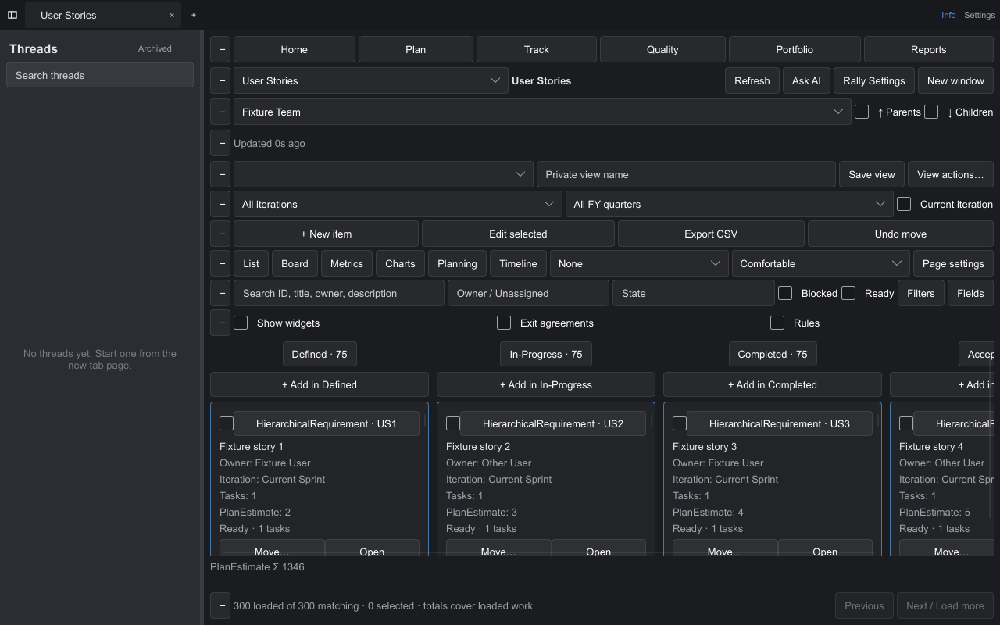
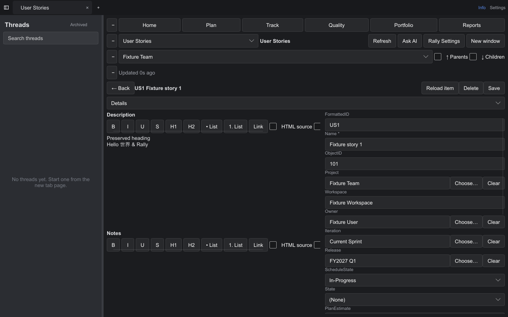
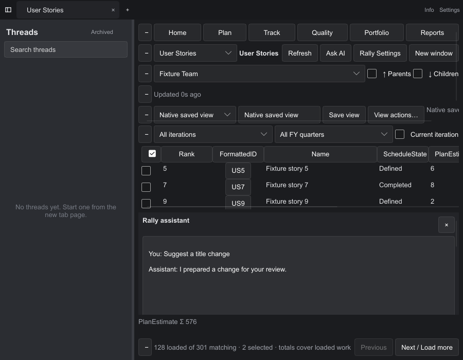

# Rust/Slint port verification

The Windows x64 fast build passed the fixture acceptance suite on `games` on
2026-10-10. All 676 headless Rust tests passed on the Mac. The Mac executable
compiled successfully; no GUI was launched on the Mac.

The original Rally layout and behavior accounting, source-function index and
R01–R22 implementation ledger are in [RALLY-INVENTORY.md](RALLY-INVENTORY.md).
The imported codex-gui revision is `be94e52cc21c5d262805e044e75267885bc73a3d`;
the preserved Go baseline is `f523c6b7ae6f9b6a12ca951845b56d81cb76a879`.

## Commands and outcomes

| Check | Outcome |
|---|---|
| `python3 dev/check-build-policy.py` | Passed; dev/release/test and build-script settings, flags and entrypoints checked |
| `cargo fmt --all -- --check` and `git diff --check` | Passed |
| `cargo test --locked --lib -- --skip window_runtime::tests` | 676 passed, zero failures, one GUI test filtered out on the Mac |
| `cargo xwin build --locked --target x86_64-pc-windows-msvc --bin fastrock` | Passed, dev/unoptimized; final incremental build 1 minute 11 seconds |
| `python dev/windows-rally-smoke.py fastrock.exe`, interactive session on `games` | Passed; 80 fixture requests and 12 explicit writes |
| `cargo build --locked --bin fastrock`, Mac | Passed, dev/unoptimized; final incremental build 1 minute 32 seconds |
| Installed Mac Codex CLI 0.162.0, read-only stdio initialize/config/model-list | Passed; seven models returned, no inference or Rally writes |

Toolchain: Rust 1.95.0; native Slint 1.18.1 software renderer. Timings describe
these machines and their existing caches, rather than a promised cold-build time.
Two retained upstream compatibility/dead-code warnings remain on Windows; the
Mac also reports an unused platform-specific interruption helper. No compile
errors remain.

The exact executable exercised on `games` has SHA-256:

```text
6858f4cfb257b90976949d00a8b7198d59efa6133c1dd25664704d9cf0822d5f
```

`BUILD.json` inside each package records the source commit, dirty status, binary
hash, profile, upstream pins and external Codex prerequisite. A GitHub-built
binary has its own hash and fixture run. The packaging script never recompiles
or optimizes; ZIP entries are stored without a compression pass.

## Native Windows coverage

The suite launches the actual Slint executable with a loopback WSAPI fixture and
an external stdio Codex fixture. It records requests without authorization
headers and retains screenshots, state dumps, session files, an executable hash
and `acceptance.json` under `build/rally-smoke` on Windows. The local final copy is
`build/rally-windows-alpha2-evidence`. These generated outputs are ignored by Git.

Coverage includes horizontal document tabs, a chats-only sidebar, list paging,
300-card board paging, mixed concrete artifact types, vertical Owner swimlanes,
card-field settings, relative ranking and Undo. A Windows mouse gesture actually
drags a card between workflow lanes. A native User-picker button click is checked
for closing the picker and supplying a typed reference to bulk review.

The remaining settled callback scenarios cover typed edit/save, create with the
Completed-lane default, related Tasks/Attachments/Revisions/Discussions reads,
posting a discussion, rich HTML source save, sparse mutation responses, late
edits during a delayed save, retained in-flight write guards on invalid input,
paging to the created artifact, dirty-navigation
Save/Discard/Cancel, private-view snapshots, unapplied-filter isolation, row
hide/restore, reviewed bulk updates, an assistant proposal followed by explicit
human Apply, narrow layouts, restart with unsaved fields/comments, and popout
plus transfer back with drafts and filters preserved. Assertions inspect the
corresponding request payloads and persisted state rather than button names alone.

Hosted runners use `--ci` to drive the board move callback rather than an OS mouse
gesture. The default suite on `games` still requires the real gesture. Alpha.1's
hosted run passed 675 Windows Rust tests and compilation, then failed its OS-drag
assertion; the follow-up workflow uses the callback mode and retains fixture
evidence even on failure. The acceptance receipt explicitly records the mode.

HTTP and pure Rust tests also exercise complete collection paging, full-query
CSV scope and formula neutralization, malformed or changing pages, reference and
type guards, token redaction, mutation non-retry, revision conflicts, attachment
size/download/orphan cleanup, stale cache invalidation, three-way merge, partial
batch outcomes, acknowledgement/collection-summary/late-edit merging and legacy
settings/session migration. Transport tests cover
timeouts, cancellations, bounded frames/events and disconnect cleanup.







## Scope and distribution

This is an unsigned Windows x64 alpha. It requires installed Codex CLI 0.162.0 or
newer; the installed CLI owns inference and configuration. `games` did not have
Codex on its interactive PATH, so its UI tests used the explicit external-process
fixture. The real installed CLI was checked read-only on the Mac.

No real Rally endpoint or token was used and no real Rally write was made.
Attachment file dialogs and individual DPI scaling configurations are implemented
but were not driven in this acceptance run. Vault key compatibility was checked
without replacing live credentials. Rich source preserves HTML beyond the
supported native formatting subset. Revision preflight cannot make WSAPI writes
atomic, and batch outcomes deliberately describe partial success.

Free space remained approximately 2.2 TiB on the Mac and 3.06 TB on `games`.
No cleanup was needed; useful incremental caches were retained. The build policy
and disk-space practice are persistent in AGENTS.md and docs/releases.md.
